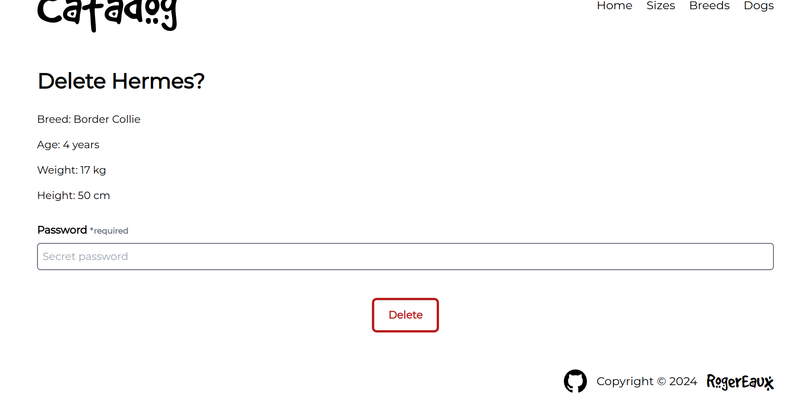

# Project - Inventory Application

This project is a website that provides an inventory management system for a dog adoption center where users can see, create, update and delete different dogs in the system. The project is built upon the Express framwork via Express Generator. It uses an MVC design to manage data and handle requests. Models were created using Mongoose and data is stored in a Mongo database. EJS was used to create the views while using Tailwind to style them. Incoming data is validated using Express Validator. Additionally the application uses multer to process and temporarily store images to upload to Cloudinary to avoid storing image files in the Mongo database.

[Checkout the live version here](https://github.com/RogerEaux/inventory-application)

## Features

- Routes: The site is structured in different main routes: index, sizes, breeds and dogs.

  - The index route acts as a home page and welcome to users where general information and content of the inventory is displayed.
  - The sizes routes deals with content related to sizes
  - The sogs routes deals with content related to breeds
  - The dogs routes deals with content related to dogs

- NavBar: Users have the ability to navigate through all the items and categories in the inventory

- Persistent Data: By using a cloud-based database solution, the application can keep track of data being manipulated and allow it to persist

- Operations: Users can create, update and delete entries of both breeds and dogs by using forms to enter the data they want to enter or manipulate in the database given they know the password

- Validation: The application validates and sanitizes the data entered through the forms to be stored into the database

- Responsive: The design of the website is inherently responsive, taking advantage of different viewing sizes to display the content in both aesthetically pleasing and effective ways

## Built using

- NodeJS
- Express + Express Generator
- Express Validator
- MongoDB + Mongoose
- Multer + Cloudinary
- EJS
- TailwindCSS

## Screenshots

Home Page


Breed List


Size Detail - Small


Dog Form - Update Hephaestus


Dog Delete - Delete Hermes



## Run locally

To setup and work on this project locally:

1. Clone the project

HTTP

```
$ git clone https://github.com/RogerEaux/inventory-application.git
```

SSH

```
$ git clone git@github.com:RogerEaux/inventory-application.git
```

2. Move to the cloned directory

```
cd inventory-application
```

3. Install dependencies

```
npm install
```

4. Set up environment variables

Create a .env file in the main directory and add the following environment variables:

```
MONGODB_URI = Your MongoDB connection string
CLOUDINARY_CLOUD_NAME = Your cloudinary cloud name
CLOUDINARY_API_KEY = Your cloudinary API key
CLOUDINARY_API_SECRET = Your cloudinary API secret
PASSWORD = Password for performing CRUD operations with forms
```

5. Start the server

```
npm run serverstart
```
